```bash
author : ohh
created: 2022年12月13日09:16:32
updated: 2022年12月14日14:59:55
title  : windows 右键菜单实践
```

本文主要讲述了如何通过windows shell外壳编程接口，实现向文件资源管理器explorer.exe注册添加右键菜单的方法。于网上，相关的代码和技术文章也繁多，本文并非首创，不过是总结他人的成果罢了。一个小的建议：在阅读完本文之后，可以参阅一下**TortoiseGit**开源项目，相关的代码在网络上很容易找到。毕竟，SVN和Git就是windows右键菜单扩展的最典型例子了。

## Intro

在正式进入介绍之前，我们先针对以下名词统一一下叫法表述。

ContextMenu 即右键菜单、上下文菜单，选中文件或文件夹右键时弹出的菜单列表。

explorer.exe 即文件资源管理器，通常我称之为“文管”。

接下来，我们以实现以下需求为引子进行介绍：

1. 有两个一级菜单，名称为【示例菜单】和【示例菜单-关于】

2. 右键选中单文件时，点击【示例菜单】项展示二级菜单【示例-文件路径】，点击则弹出对话框显示选中文件的路径

3. 右键选择多个文件时，点击【示例菜单】项展示二级菜单【示例-多文件路径】，点击则弹出对话框显示选中的文件路径

4. 大概意思如下是也:

```bash
# 选择单文件时
+ 示例菜单
  + 示例-文件路径
  + 示例菜单-关于
# 选择多文件时
+ 示例菜单
  + 示例-多文件路径
  + 示例菜单-关于
```

## Shell Interface

本小节简单介绍windows提供的相关shell 扩展接口，以及如何使用之，更加详细接口参数介绍和使用方法请参考MSDN相关文档，我想它们已阐述地足够精细了，不必再此多费口舌。

首先，我们主要继承了windows shell 的两个接口：`IShellExtInit`和`IContextMenu`.见其名称可知，其中`IContextMenu`是实现右键菜单的主要类，然而在编写基于`IContextMenu`和`IShellPropSheetExt`接口的程序时，需要使用`IShellExtInit`来完成相应的Shell初始化Shell扩展对象的初始化工作，因此是必须的。

### IShellExtInit

IShellExtInit接口用于Shell初始化Shell扩展对象的初始化工作。我们将继承并实现其`Initialize`接口，该接口供于Shell调用以初始化Shell扩展对象。

```cpp
HRESULT Initialize(
  [in] PCIDLIST_ABSOLUTE pidlFolder,
  [in] IDataObject       *pdtobj,
  [in] HKEY              hkeyProgID
);
```

tips: 参数详情参见MSDN链接。值得注意的是，当我们期望展示我们的菜单时，该函数应当返回S_OK以表生效。

### IContextMenu

IContextMenu接口描述了右键菜单的信息以及点击菜单项时的反应，即以下三个函数：

```cpp
HRESULT GetCommandString(
  UINT_PTR idCmd,
  UINT     uType,
  UINT     *pReserved,
  CHAR     *pszName,
  UINT     cchMax
);
```

该方法用于返回谓词的规范名称，非必选。 在 Windows XP 和早期版本的 Windows中，当Windows资源管理器具有状态栏时，此方法用于检索菜单项的状态栏中显示的帮助文本。

```cpp
HRESULT InvokeCommand(
  CMINVOKECOMMANDINFO *pici
);
```

当用户单击菜单项以告知处理程序运行关联的命令时，将调用此方法。 *pici* 参数指向包含运行命令所需的信息的结构。

```cpp
HRESULT QueryContextMenu(
  HMENU hmenu,
  UINT  indexMenu,
  UINT  idCmdFirst,
  UINT  idCmdLast,
  UINT  uFlags
);
```

此方法能够将我们的菜单项添加至右键菜单。 其中，indexMenu参数为可用于添加菜单项的起始索引，即我们菜单展示的地方。（毕竟菜单列表从上至下也是有顺序的）

> 在此方法中，我们可根据业务，调用 [InsertMenu](https://learn.microsoft.com/en-us/windows/desktop/api/winuser/nf-winuser-insertmenua) 或 [InsertMenuItem](https://learn.microsoft.com/en-us/windows/desktop/api/winuser/nf-winuser-insertmenuitema) 以将其菜单项插入到 *hmenu* 指定的菜单中。*参数*保存要用于第一个菜单项的索引。每个菜单项的标识符必须在 *idCmdFirst* 和 *idCmdLast* 定义的范围内。
> 
> 一种常见的做法是将第一个命令标识符设置为 *idCmdFirst*（偏移量为零），并将每个附加命令的偏移量递增 1。这种做法可确保不超过 *idCmdlast*，并保留可供其他处理程序使用的标识符范围。存储偏移量以供参考，因为它们可用于在后续调用 [IContextMenu：：GetCommandString](https://learn.microsoft.com/en-us/windows/desktop/api/shobjidl_core/nf-shobjidl_core-icontextmenu-getcommandstring) 和 [IContextMenu：：InvokeCommand](https://learn.microsoft.com/en-us/windows/desktop/api/shobjidl_core/nf-shobjidl_core-icontextmenu-invokecommand) 时标识命令。

## Dev & Impl

> 系统: Windows10
> 
> 开发工具: VSCode2019
> 
> 帮助工具: shexview.exe/shmnview.exe

接下来，本小节从VS创建工程开始，逐步地介绍如何实现右键菜单示例。

### Project

创建ATL项目，一路默认。

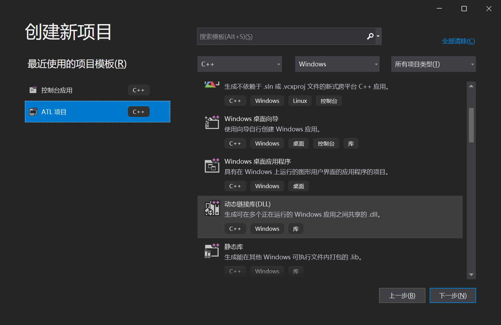

修改以下项目属性，关闭注册输出，以及改一下目标文件的名称。

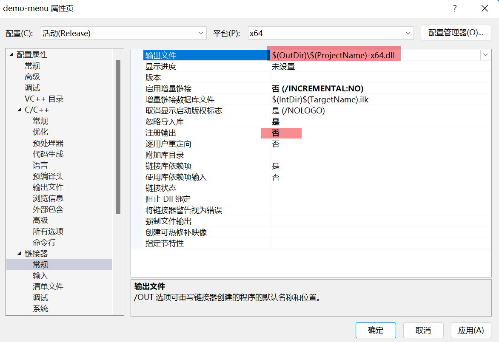

右键解决方案--->添加--->新建项--->ATL简单对象。输入类名，继续下一步。

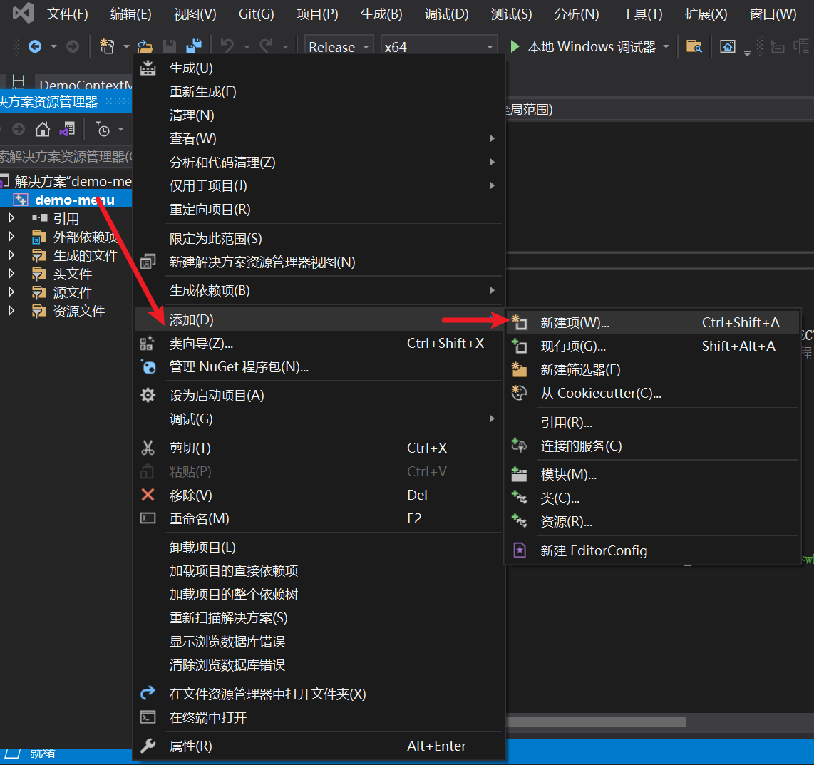

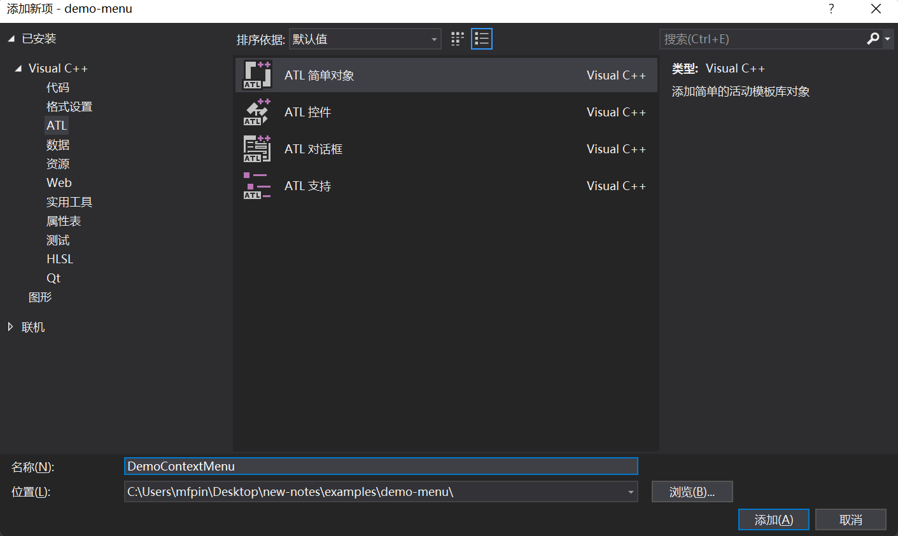

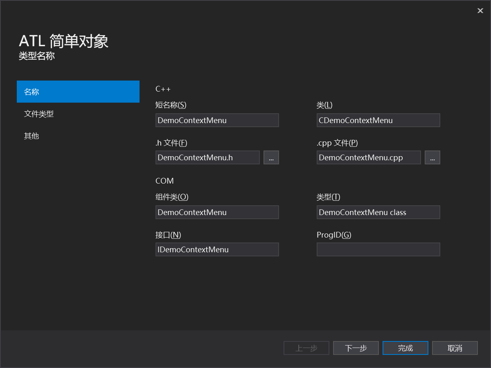

到这一步，我们会发现项目多了三个文件`DemoContextMenu.h`、`DemoContextMenu.rgs`、`DemoContextMenu.rgs`. OK, 现在让我们开始来实现对应的接口吧。

Files

tips:  也可参考`https://github.com/TortoiseGit/TortoiseGit/src/TortoiseShell/`下的源码，即TortoiseGit有关于windows右键菜单的实现。

### Coding

```cpp
// DemoContextMenu.h: CDemoContextMenu 的声明

#pragma once
#include "resource.h"       // 主符号
#include "demomenu_i.h"

#include<shlobj.h>
#include<shobjidl.h> 

#include <string>
#include <vector>

#if defined(_WIN32_WCE) && !defined(_CE_DCOM) && !defined(_CE_ALLOW_SINGLE_THREADED_OBJECTS_IN_MTA)
#error "Windows CE 平台(如不提供完全 DCOM 支持的 Windows Mobile 平台)上无法正确支持单线程 COM 对象。定义 _CE_ALLOW_SINGLE_THREADED_OBJECTS_IN_MTA 可强制 ATL 支持创建单线程 COM 对象实现并允许使用其单线程 COM 对象实现。rgs 文件中的线程模型已被设置为“Free”，原因是该模型是非 DCOM Windows CE 平台支持的唯一线程模型。"
#endif

using namespace ATL;


// CDemoContextMenu

class ATL_NO_VTABLE CDemoContextMenu :
    public CComObjectRootEx<CComSingleThreadModel>,
    public CComCoClass<CDemoContextMenu, &CLSID_DemoContextMenu>,
    public IDispatchImpl<IDemoContextMenu, &IID_IDemoContextMenu, &LIBID_demomenuLib, /*wMajor =*/ 1, /*wMinor =*/ 0>,
    public IShellExtInit,
    public IContextMenu

{
public:
    CDemoContextMenu()
    {
    }

DECLARE_REGISTRY_RESOURCEID(106)


BEGIN_COM_MAP(CDemoContextMenu)
    COM_INTERFACE_ENTRY(IDemoContextMenu)
    COM_INTERFACE_ENTRY(IDispatch)
    COM_INTERFACE_ENTRY(IShellExtInit)
    COM_INTERFACE_ENTRY(IContextMenu)
END_COM_MAP()


    DECLARE_PROTECT_FINAL_CONSTRUCT()

    HRESULT FinalConstruct()
    {
        return S_OK;
    }

    void FinalRelease()
    {
    }

public:
    // IShellExtInit Interfaces
    STDMETHODIMP    Initialize(PCIDLIST_ABSOLUTE pidlFolder, IDataObject* pdtobj, HKEY hkeyProgID);

    // IContextMenu Interfaces
    STDMETHODIMP    QueryContextMenu(HMENU hMenu, UINT indexMenu, UINT idCmdFirst, UINT idCmdLast, UINT uFlags);
    STDMETHODIMP    InvokeCommand(LPCMINVOKECOMMANDINFO lpcmi) ;
    STDMETHODIMP    GetCommandString(UINT_PTR idCommand, UINT uFlags, UINT* pReserved, PSTR pszName, UINT cchName);

private:
    void            TweakMenu(HMENU menu);
private:
    enum MyCmd
    {
        CMD_ROOT,
        CMD_SHOW_FILEPATH,
        CMD_SHOW_FILEPATHS,
        CMD_SHOW_DEMO_ABOUT,
        CMD_END
    };
    struct MenuInfo
    {
        std::string name;
        // other infos
    };
    // datas
    std::vector<std::wstring> m_filepaths;        // select files
};

OBJECT_ENTRY_AUTO(__uuidof(DemoContextMenu), CDemoContextMenu)
```

```cpp
// DemoContextMenu.cpp: CDemoContextMenu 的实现

#include "pch.h"
#include "DemoContextMenu.h"

#include <strsafe.h>

// CDemoContextMenu

STDMETHODIMP CDemoContextMenu::Initialize(PCIDLIST_ABSOLUTE pidlFolder, IDataObject* pdtobj, HKEY hkeyProgID)
{
    FORMATETC fmt = { CF_HDROP, NULL, DVASPECT_CONTENT, -1, TYMED_HGLOBAL };
    STGMEDIUM stg = { TYMED_HGLOBAL };
    HDROP      hDrop;

    //空白处右键，pdtobj是空指针
    if (pdtobj == nullptr)
    {
        return E_INVALIDARG;
    }

    // 在数据对象内查找CF_HDROP类型数据。
    // 如果没有数据，返回一个错误（“无效参数”）给Explorer。
    if (FAILED(pdtobj->GetData(&fmt, &stg)))
    {
        return E_INVALIDARG;
    }

    // 取得指向实际数据的指针。
    hDrop = (HDROP)GlobalLock(stg.hGlobal);

    // 确保非NULL
    if (NULL == hDrop)
    {
        return E_INVALIDARG;
    }

    //选中文件个数
    UINT uNumFiles = DragQueryFile(hDrop, 0xFFFFFFFF, NULL, 0);

    if (0 == uNumFiles)
    {
        GlobalUnlock(stg.hGlobal);
        ReleaseStgMedium(&stg);
        return E_INVALIDARG;
    }

    // 获取选中的文件
    for (UINT index = 0; index < uNumFiles; index++)
    {
        WCHAR szFile[MAX_PATH + 1];
        if (0 == DragQueryFile(hDrop, index, szFile, MAX_PATH))
            continue;

        m_filepaths.push_back(szFile);
    }

    GlobalUnlock(stg.hGlobal);
    ReleaseStgMedium(&stg);
    return S_OK;
}


STDMETHODIMP CDemoContextMenu::QueryContextMenu(HMENU hmenu, UINT indexMenu, UINT idCmdFirst, UINT idCmdLast, UINT uFlags)
{
    // 如果标识包含了 CMF_DEFAULTONLY，那么，什么都不做
    if (uFlags & CMF_DEFAULTONLY || m_filepaths.size() <= 0)
    {
        return MAKE_HRESULT(SEVERITY_SUCCESS, FACILITY_NULL, 0);
    }

    UINT idCmd      = idCmdFirst;
    UINT uIndexMenu = indexMenu;

    InsertMenu(hmenu, uIndexMenu++, MF_SEPARATOR | MF_BYPOSITION, 0, NULL);//分割线

    // sub menus
    HMENU submenu = ::CreatePopupMenu();
    UINT uIndexSubMenu = 0;

    MENUITEMINFO submif{};
    submif.cbSize = sizeof(submif);
    submif.fType = MFT_STRING;
    submif.hbmpItem = NULL;
    submif.fMask = MIIM_STRING | MIIM_ID | MIIM_FTYPE;

    if (m_filepaths.size() == 1)
    {
        submif.wID = idCmd + CMD_SHOW_FILEPATH;
        submif.dwTypeData = L"示例-文件路径";
        submif.cch = wcslen(submif.dwTypeData);
    }
    else
    {
        submif.wID = idCmd + CMD_SHOW_FILEPATHS;
        submif.dwTypeData = L"示例-多文件路径";
        submif.cch = wcslen(submif.dwTypeData);
    }
    InsertMenuItem(submenu, uIndexSubMenu++, TRUE, &submif);

    // secord sub menuitem
    MENUITEMINFO secordmif{};
    secordmif.cbSize = sizeof(secordmif);
    secordmif.fType = MFT_STRING;
    secordmif.hbmpItem = NULL;
    secordmif.fMask = MIIM_STRING | MIIM_ID | MIIM_FTYPE;
    secordmif.wID = idCmd + CMD_SHOW_DEMO_ABOUT;
    secordmif.dwTypeData = L"示例菜单-关于";
    secordmif.cch = wcslen(secordmif.dwTypeData);
    InsertMenuItem(submenu, uIndexSubMenu++, TRUE, &secordmif);

    // root menuitem
    MENUITEMINFO rootmif{};
    rootmif.cbSize = sizeof(rootmif);
    rootmif.fType = MFT_STRING;
    rootmif.wID = idCmd + CMD_ROOT;
    rootmif.dwTypeData = L"示例菜单";
    rootmif.hbmpItem = NULL;
    rootmif.fMask = MIIM_SUBMENU | MIIM_STRING | MIIM_ID | MIIM_FTYPE | MIIM_DATA;
    rootmif.hSubMenu = submenu;
    InsertMenuItem(hmenu, uIndexMenu++, TRUE, &rootmif);

    InsertMenu(hmenu, uIndexMenu++, MF_SEPARATOR | MF_BYPOSITION, 0, NULL);//分割线 
    TweakMenu(hmenu);

    return MAKE_HRESULT(SEVERITY_SUCCESS, 0, static_cast <USHORT>(CMD_SHOW_DEMO_ABOUT+1));
}


STDMETHODIMP CDemoContextMenu::InvokeCommand(LPCMINVOKECOMMANDINFO lpcmi)
{
    if(m_filepaths.size() <= 0)     return E_INVALIDARG;

    BOOL fEx = FALSE;
    BOOL fUnicode = FALSE;

    if (lpcmi->cbSize == sizeof(CMINVOKECOMMANDINFOEX))
    {
        fEx = TRUE;
        if ((lpcmi->fMask & CMIC_MASK_UNICODE))
        {
            fUnicode = TRUE;
        }
    }

    UINT cmd = LOWORD(lpcmi->lpVerb);
    switch (cmd)
    {
        case CMD_SHOW_FILEPATH:
        {
            std::wstring text = L" 选中一个文件:  " + m_filepaths[0];
            MessageBox(lpcmi->hwnd,
                text.c_str(),
                L"Demo Context Menu",
                MB_OK | MB_ICONINFORMATION);
            break;
        }
        case CMD_SHOW_FILEPATHS:
        {
            std::wstring text = L" 选中多个文件:  \n";
            for (int i = 0; i < m_filepaths.size(); i++)
            {
                text += m_filepaths[i] + L"\n";
            }
            MessageBox(lpcmi->hwnd,
                text.c_str(),
                L"Demo Context Menu",
                MB_OK | MB_ICONINFORMATION);
            break;
        }
        case CMD_SHOW_DEMO_ABOUT:
        {
            MessageBox(lpcmi->hwnd,
                L" A demo of context menu! \n I'm ohh!",
                L"Demo Context Menu",
                MB_OK | MB_ICONINFORMATION);
            break;
        }
        default:
            return E_INVALIDARG;
    }

    return S_OK;
}


STDMETHODIMP CDemoContextMenu::GetCommandString(UINT_PTR  idCommand,
    UINT uFlags,
    UINT* pReserved,
    PSTR pszName,
    UINT cchName)
{
    HRESULT hr = E_INVALIDARG;

    if(uFlags & GCS_HELPTEXTW)
    {
            // Only useful for pre-Vista versions of Windows that 
            // have a Status bar.
            hr = StringCchCopyW(reinterpret_cast<PWSTR>(pszName),  cchName, L"A Demo Context Menu");
    }
    else if (uFlags & GCS_HELPTEXT)
    {
        hr = StringCchCopyA(pszName, cchName, "A Demo Context Menu");
    }
    return hr;
}

void CDemoContextMenu::TweakMenu(HMENU hMenu)
{
    MENUINFO MenuInfo = {};
    MenuInfo.cbSize = sizeof(MenuInfo);
    MenuInfo.fMask = MIM_STYLE | MIM_APPLYTOSUBMENUS;
    MenuInfo.dwStyle = MNS_CHECKORBMP;
    SetMenuInfo(hMenu, &MenuInfo);
}
```

在`Initialize`函数中我们获取到了选中的文件路径，并将其存在变量`m_filepaths`中。在生成菜单时，wid等于idCmd加上CMD_XX即偏移量，是因为在`InvokeCommand`函数中，根据入参我们能够得到是偏移量（见MSDN文档介绍），故我们视偏移量为cmd。

```bash
         +---------+
         |         |
indexMenu+---------+ +-------------+
         | 示例菜单| | 示例——单文件   | idCmdFirst + CMD_SHOW_FILEPATH
         +---------+ +-------------+
         |  ...... | | 示例——关于   | idCmdFirst + CMD_SHOW_DEMO_ABOUT
         +---------+ +----------+--+                        +
         |   ...   |            |                           |
         |         |            |                           v
         |         |            |
         |  .....  |            |             +------------------------+
         |         |            |  clicked    |                        |
         +---------+            +------------>+    MessageBox          |
                                              |                        |
                                              +------------------------+
```

在此，我们还需修改一下`.rgs`文件，如下：

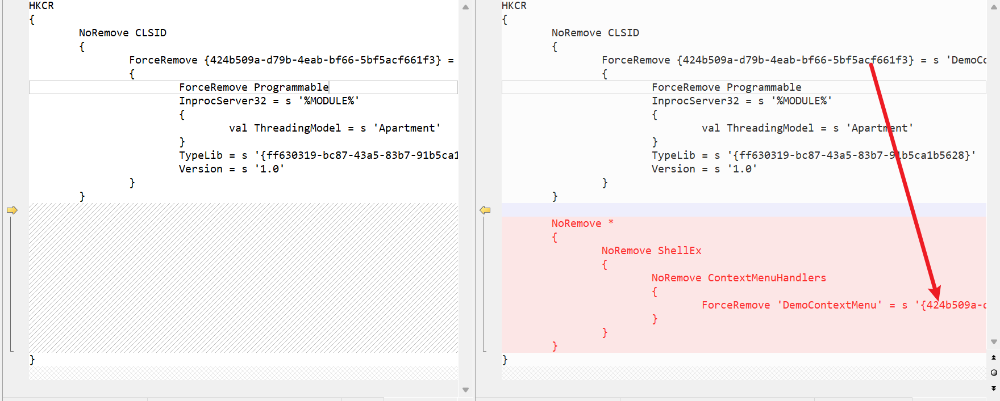

```context
NoRemove *
    {
        NoRemove ShellEx
        {
            NoRemove ContextMenuHandlers
            {
                ForceRemove 'DemoContextMenu' = s '{424b509a-d79b-4eab-bf66-5bf5acf661f3}'
            }
        }
    }
```

## Debug & Demo

正常开机启动的系统桌面即explorer.exe进程是64位的（就64位机器而言），因此我们需要注册的是x64版本的dll. 实际业务中，x64和x86都需要注册，x86的dll的加载发生在32位的应用程序调用explorer.exe，如【选中文件】、【打开文件夹】.

```bash
# 注册菜单dll
regsvr32 demo-menu-x64.dll
# 反注册卸载菜单dll
regsvr -U demo-menu-x64.dll
```

如何调试？

1. 系统管理员权限打开 cmd.exe, 打开生成目录，`regsvr32 -U demo-menu-x64.dll`先反注册卸载dll.

2. 进程管理器重新启动 explorer.exe

3. 继续cmd.exe窗口输入`regsvr32 demo-menu-x64.dll`注册安装dll.

4. 进程管理器重新启动 explorer.exe
   
   tips: 使用`shexview.exe`可以显示dll是否注册成功，首先得确保安装成功才能进行后续的调试。
   
   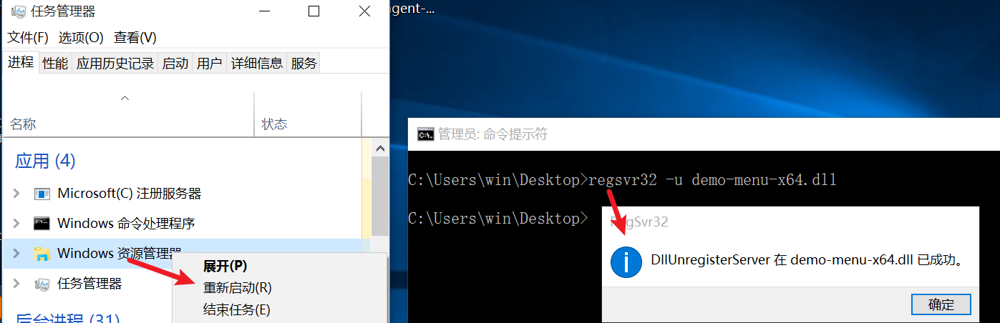
   
   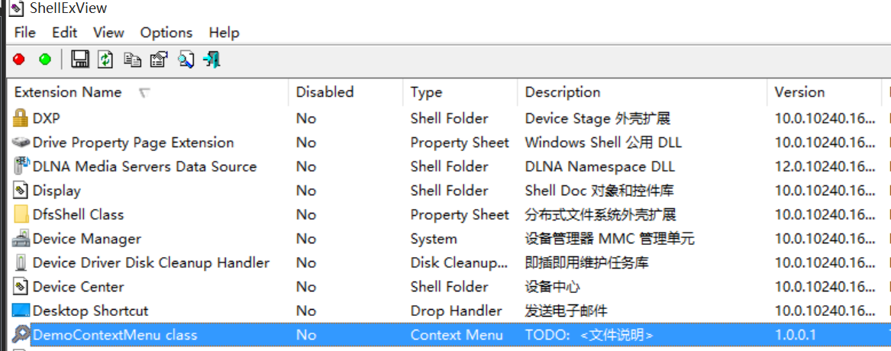

5. 以上步骤只不过是在重新安装重新生成的dll，接下来是调试之（如有必要调试的话）：
   
   1. 复制remote debugger 至虚拟机中，打开x64目录下面`msvsmon.exe`，工具-->选项--> 无身份验证；
      
      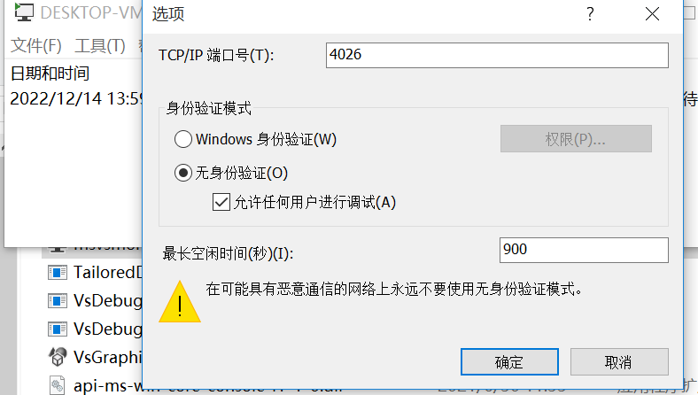
   
   2. 关闭虚拟机的防火墙或放行对应的调试端口；
   
   3. VS2019调试-->附加到进程--->远程--->附加到进程`explorer.exe`，即可调试之。
      
      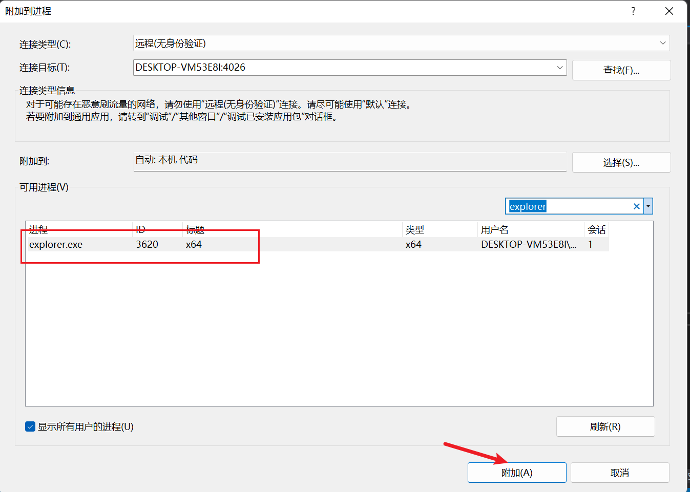
   
   tips: 因为上面是在虚拟机中进行的调试，因此用到了Remete Debugger工具，该工具是VS2019自带的，可使用everthing搜一下进行复制。如果直接在开发机器进行调试，直接附加到explorer.exe进程即可。

最终，菜单的效果展示如下：

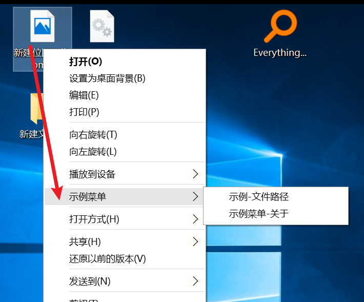

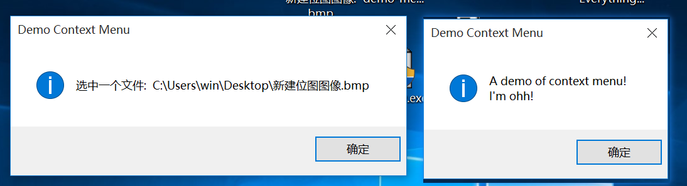

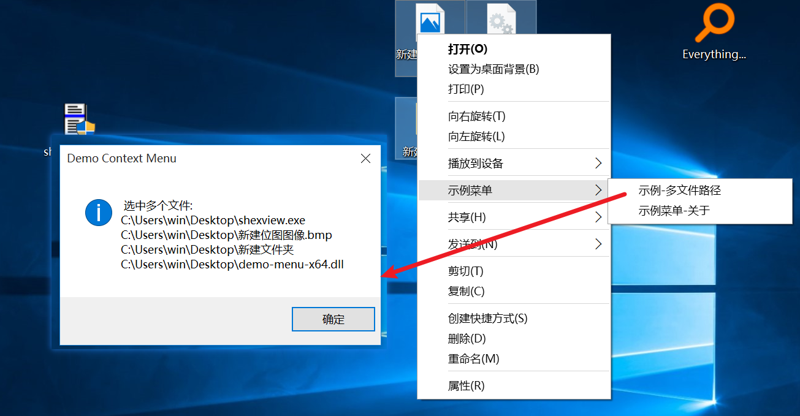

## Finally

本文主要阐述如何通过使用Shell扩展接口实现windows右键菜单，并对接口和代码实现做了简单的介绍。因此，在此基础有一些扩展可进行：

- 为菜单展示图标，此部分的代码可参考TortoiseGit Shell项目

- 实现其他类似的Shell扩展接口，如扩展属性页、类似SVN状态一样的图标覆盖

- ... ...

此外，有一些事情是需要知道的：

- 在初始化时获取到的文件路径最大长度为MAX_PATH(260)，当文件路径超出时将发生截断

- 右键菜单批量文件，当文件数量大于16时，情况可能会变得不一样，例如【打印】等菜单会消失不见。这是windows为了防止同时打开过多文件时过度消耗系统资源导致死机等故障而做的一个限制。
  
  如有需要，那么需要修改`HKEY_CURRENT_USER\Software\Microsoft\Windows\CurrentVersion\Explorer`的MultipleInvokePromptMinimum值.

## Reference

[IContextMenu (shobjidl_core.h) - Win32 apps | Microsoft Learn](https://learn.microsoft.com/en-us/windows/win32/api/shobjidl_core/nn-shobjidl_core-icontextmenu)

[IShellExtInit (shobjidl_core.h) - Win32 apps | Microsoft Learn](https://learn.microsoft.com/en-us/windows/win32/api/shobjidl_core/nn-shobjidl_core-ishellextinit)

[如何实现 IContextMenu 接口 - Win32 apps | Microsoft Learn](https://learn.microsoft.com/zh-cn/windows/win32/shell/how-to-implement-the-icontextmenu-interface)

[TortoiseGit/TortoiseGit: Windows Explorer Extension to Operate Git](https://github.com/TortoiseGit/TortoiseGit)
