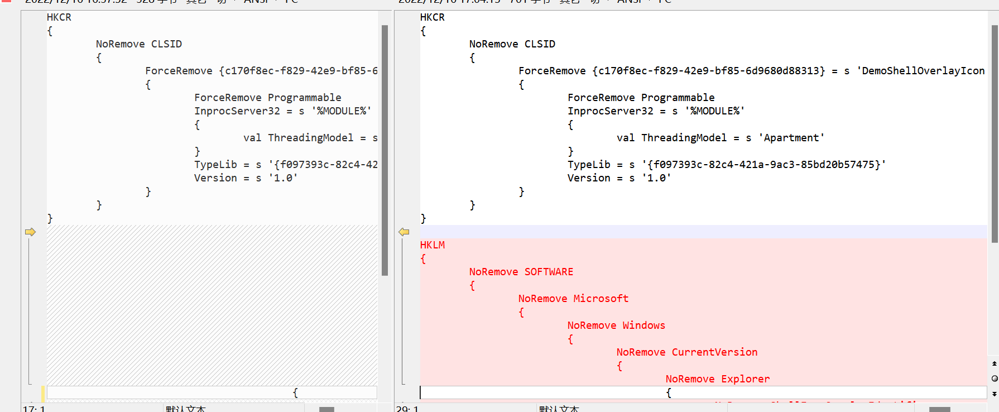
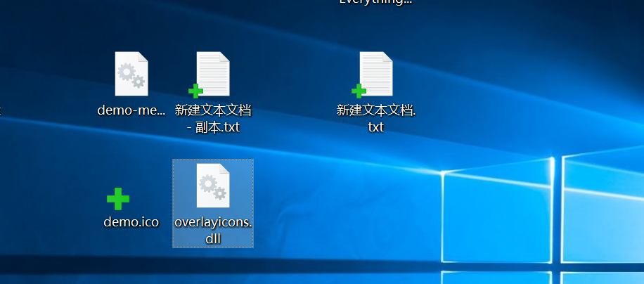
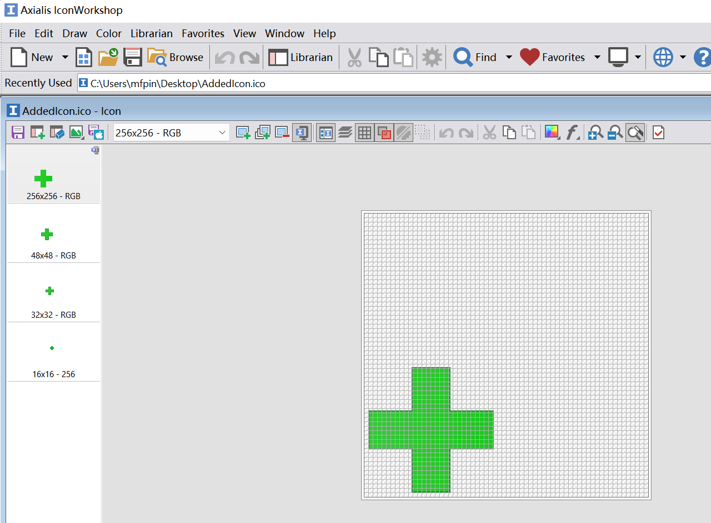

```bash
author : ohh
created: 2022年12月13日09:16:32
updated: 2022年12月13日09:16:36
title  : windows 图标覆盖实践
```

本文主要讲述了如何通过windows shell外壳编程接口，实现和SVN状态类似的图标覆盖功能。在查找资料和学习的过程，我参考借鉴了`TortoiseGit`项目的Shell部分，该项目和SVN对于图标覆盖的处理都指向了一个名为`TortoiseOverlays`的项目，个人认为值得一阅。

## Intro

不知使用SVN进行代码版本控制的你,是否有遇到过SVN的图标突然不显示了，于是在网络上搜索 `svn icons not showing`  或 `svn状态图标不显示` ....一般来讲结果可能会如下：

- 卸载重装SVN.........

- 打开注册表修改某某某.......

- ................

## Shell Interface

实现windows图标覆盖主要使用了**IShellIconOverlayIdentifier**接口，并继承实现以下方法：

```cpp
 HRESULT GetOverlayInfo(
  [out] LPWSTR pwszIconFile,
        int    cchMax,
  [out] int    *pIndex,
  [out] DWORD  *pdwFlags
);
```

此方法用于指示图标文件的位置。其中，以`pwszIconFile`返回一个以 null 结尾的 Unicode 字符串，其中包含包含图标的文件的全路径。 .dll、.exe和 .ico 文件类型都是可接受的。 如果返回文件名，则必须在 *pdwFlags* 中设置**ISIOI_ICONFILE**标志。

> Notes：此方法在dll初始化加载时由 Shell 调用，然后将图标添加到系统映像列表，此后变无法修改之，而文件名和索引仅仅用于标识图标覆盖。

也就是说，如果在dll初始化时加载的图标内容是一个`A`的形状，那么后继explorer在进行图标覆盖时展示的都是`A`，即使你在加载之后将其替换为`B`的形状，也无济于事。即图标的加载仅会发生一次。

```cpp
HRESULT GetPriority(
  [out] int *pPriority
);
```

此方法用户指定图标覆盖的优先级， 取值范围为0~100，0表示最高优先级，通常都设为0.

> Notes: 此优先级值的目的是帮助 Shell 解决为单个对象指定多个图标覆盖时出现的冲突。 Shell 首先使用一组**内部规则**来确定最高优先级图标覆盖。 如果这些规则无法解决冲突，则 **GetPriority** 分配给图标覆盖的值确定优先级。

```cpp
HRESULT IsMemberOf(
  [in] LPCWSTR pwszPath,
       DWORD   dwAttrib
);
```

此方法表示是否展示覆盖图标，当返回S_OK时表示展示，S_FALSE时表示不展示。入参`pwszPath`是一个Unicode 字符串的文件路径，我们可以在此基础添加业务逻辑用于处理图标覆盖的展示。例如，当文件后缀名为`.txt `时返回S_OK,否则返回S_FALSE.

## Dev & Impl

有了之前右键菜单的工程建立、编码和调试经验，再实现windows的图标覆盖变得十分容易。当然，这本身也不难，毕竟MSDN也有相应的实现文章<sup>见参考</sup>。

### Project

> 此部分内容于文章《windows 右键菜单实践》重复，就不做介绍了。

### Coding

在此，我们以实现给`.txt`文件添加图标覆盖为例。

```cpp
// DemoShellOverlayIcon.h: CDemoShellOverlayIcon 的声明

#pragma once
#include "resource.h"       // 主符号

#include<shlobj.h>

#include "overlayicons_i.h"


#if defined(_WIN32_WCE) && !defined(_CE_DCOM) && !defined(_CE_ALLOW_SINGLE_THREADED_OBJECTS_IN_MTA)
#error "Windows CE 平台(如不提供完全 DCOM 支持的 Windows Mobile 平台)上无法正确支持单线程 COM 对象。定义 _CE_ALLOW_SINGLE_THREADED_OBJECTS_IN_MTA 可强制 ATL 支持创建单线程 COM 对象实现并允许使用其单线程 COM 对象实现。rgs 文件中的线程模型已被设置为“Free”，原因是该模型是非 DCOM Windows CE 平台支持的唯一线程模型。"
#endif

using namespace ATL;


// CDemoShellOverlayIcon

class ATL_NO_VTABLE CDemoShellOverlayIcon :
    public CComObjectRootEx<CComSingleThreadModel>,
    public CComCoClass<CDemoShellOverlayIcon, &CLSID_DemoShellOverlayIcon>,
    public IDispatchImpl<IDemoShellOverlayIcon, &IID_IDemoShellOverlayIcon, &LIBID_overlayiconsLib, /*wMajor =*/ 1, /*wMinor =*/ 0>,
    public IShellIconOverlayIdentifier
{
public:
    CDemoShellOverlayIcon()
    {
    }

DECLARE_REGISTRY_RESOURCEID(106)


BEGIN_COM_MAP(CDemoShellOverlayIcon)
    COM_INTERFACE_ENTRY(IDemoShellOverlayIcon)
    COM_INTERFACE_ENTRY(IDispatch)
    COM_INTERFACE_ENTRY(IShellIconOverlayIdentifier)
END_COM_MAP()


    DECLARE_PROTECT_FINAL_CONSTRUCT()

    HRESULT FinalConstruct()
    {
        return S_OK;
    }

    void FinalRelease()
    {
    }

public:


    // IShellIconOverlayIdentifier Interfaces
    STDMETHODIMP GetOverlayInfo(LPWSTR pwszIconFile, int cchMax, int* pIndex, DWORD* pdwFlags);
    STDMETHODIMP  IsMemberOf(LPCWSTR pwszPath,DWORD   dwAttrib);
    STDMETHODIMP  GetPriority(int* pPriority);
};

OBJECT_ENTRY_AUTO(__uuidof(DemoShellOverlayIcon), CDemoShellOverlayIcon)
```

```cpp
// DemoShellOverlayIcon.cpp: CDemoShellOverlayIcon 的实现

#include "pch.h"
#include "DemoShellOverlayIcon.h"
#include<string>

// CDemoShellOverlayIcon

STDMETHODIMP  CDemoShellOverlayIcon::GetOverlayInfo(LPWSTR pwszIconFile, int cchMax, int* pIndex, DWORD* pdwFlags)
{
    // 简单演示，绝对路径
    wcscpy_s(pwszIconFile, cchMax, L"C:\\demo.ico");
    *pIndex = 0;
    *pdwFlags = ISIOI_ICONFILE | ISIOI_ICONINDEX;

    return S_OK;
}

STDMETHODIMP  CDemoShellOverlayIcon::IsMemberOf(LPCWSTR pwszPath, DWORD   dwAttrib)
{
    // 简单的判断，并不准确
    if (NULL != wcsstr(pwszPath, L".txt"))
    {
        return S_OK;
    }    
    return S_FALSE;
}

STDMETHODIMP  CDemoShellOverlayIcon::GetPriority(int* pPriority)
{
    return 0;
}
```

颠三倒四

```bash
HKLM
{
    NoRemove SOFTWARE
    {
        NoRemove Microsoft
        {
            NoRemove Windows
            {
                NoRemove CurrentVersion
                {
                    NoRemove Explorer
                    {
                        NoRemove ShellIconOverlayIdentifiers
                        {
                            ForceRemove  '      DemoShellOverlayIcon class' = s '{c170f8ec-f829-42e9-bf85-6d9680d88313}'
                            {
                            }
                        }
                    }
                }
            }
        }
    }
}
```



## Debug & Demo

> 调试部分内容于文章《....》重复，就不做介绍了。



## How to Create Shell Icons？

首先，可以做这么一个尝试：用下面的工具打开SVN的状态图标（相信你能很容易就找到SVN的状态图标，无论是从本地还是[github](https://github.com/TortoiseGit/TortoiseGit/tree/master/src/Resources/Icons/Win10)）看看，就会发现左边展示了不同尺寸的png图标，即16*16、32\*32、48\*48、256\*256.....



我们可以使用如下两个工具制作windows的图标：

- Axialis IconWorkshop 专业、强大，30天的免费试用期。在参考链接中有一篇关于如何使用其制作图标的文章可供参阅

- Greenfish Icon Editor Pro 1.72 免费，但没有Axialis IconWorkshop强大

此外，我还找到一个png转ico格式的工具，即能够将多张尺寸(整除8)的.png合并成一张.ico，见参考的`png2ico`链接。当然，你也可以动手编写一个类似的工具，也不是什么难事。

```bash
png2ico favicon.ico logo16x16.png logo32x32.png
```

## Finally

图标个数问题：因此回到最初的那个问题，也许你的SVN状态图标不见了可能仅仅是因为“名额”被别的软件占用了.....是的，图标的个数是有限的（上限应该是15个，见参考链接），当系统中存在多个图标时，如果你的图标排在别人的后面，那么将得不到展示的机会。因此，为了排在别人的前面，不得不使用一些稍显流氓的手段以确保我们的覆盖图标总能显示。而方法便是：给徽标注册表值前面加上很多空格（毕竟空格是ASCII码中能用中排在最前面的字符了）。

随心所欲地触发图标刷新：当文件发生改变时，比如修改时间、文件名等发生了变化那么explorer.exe便会触发覆盖图标的刷新。但当上述变化没有发生时，那么也就不会触发刷新，即图标的刷新是一种被动行为。有没有可能实现在我们想要刷新的时候刷新图标呢？即使文件信息未发生改变。答案当然是可行的。在windows中有一个接口：

```cpp
void SHChangeNotify(
                 LONG    wEventId,
                 UINT    uFlags,
  [in, optional] LPCVOID dwItem1,
  [in, optional] LPCVOID dwItem2
);
```

其中的参数众多，详情请见链接参阅MSDN文档。一个例子是：

```bash
SHChangeNotify(SHCNE_UPDATEITEM, 
SHCNF_PATH | SHCNF_FLUSHNOWAIT, 
filepath, nullptr)
```

无法实现图标主题风格切换实时生效：在SVN中我们可以使用不同状态图标风格，然而这些主题切换操作并不会立即生效，而是需要重启电脑（或是重启explorer.exe）。这个问题我们在说明`IShellIconOverlayIdentifier::GetOverlayInfo`时已经提到，这是因为图标的加载仅会发生一次。

设计视觉效果更好的图标：我们惊奇的发现，SVN的状态图标并不是布满整个画布，而是将有效的内容仅仅绘制在左下角（经测量占比大约在0.625~0.628），很显然是有意为之。为此，我尝试比较了布满和居于左下角的图标的覆盖效果，结果显示在某些缩放比例下，布满的总是要逊色于居于左下角的。

## Reference

[Why is there a limit of 15 shell icon overlays? - The Old New Thing](https://devblogs.microsoft.com/oldnewthing/20190313-00/?p=101094#comments)

[tortoisesvn/src/TortoiseOverlays](https://github.com/TortoiseGit/tortoisesvn/tree/master/src/TortoiseOverlays)

[如何实现图标覆盖处理程序 - Win32 apps | Microsoft Learn](https://learn.microsoft.com/zh-cn/windows/win32/shell/how-to-implement-icon-overlay-handlers)

[dkfans/png2ico: Converts PNG files to Windows .ICO icon resource files.](https://github.com/dkfans/png2ico)

[png2ico - PNG to icon converter (Linux,GNU,Windows,Unix)](http://winterdrache.de/freeware/png2ico/index.html)

[How to create your own Windows icons? - Axialis Software](https://www.axialis.com/tutorials/make-your-own-icons.html)

[SHChangeNotify function (shlobj_core.h) - Win32 apps | Microsoft Learn](https://learn.microsoft.com/en-us/windows/win32/api/shlobj_core/nf-shlobj_core-shchangenotify)
